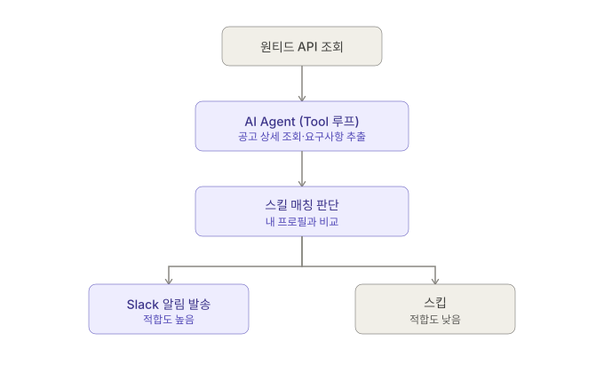

해야할 것. AI agent라는 무엇인가? 뭘 해봐야하는가?
1. API 키 발급 + Hello World
Anthropic Console(console.anthropic.com) 또는 OpenAI에서 API 키 발급받고, Python으로 메시지 한 번 보내고 응답 받는 것부터 (30분). 이게 안 되면 다음 단계 다 막힘.
2. Tool Use(Function Calling) 익히기
'날씨 조회', '계산기' 같은 간단한 함수 1~2개를 정의해서 LLM이 스스로 '이 함수를 호출해야겠다'고 판단하게 만들어보기. 여기서 tool_use / tool_result 흐름을 몸으로 이해하는 게 핵심 (2~3시간).
3. Multi-step 루프 만들기
한 번의 호출로 끝내지 않고, LLM이 도구 결과를 받아서 '더 필요한 작업이 있는지' 스스로 판단해 반복하는 while 루프 구조를 짜기. 이게 바로 'Agent'라고 불리는 것의 실체입니다 (2~3시간).
4. 실용적인 미니 프로젝트로 확장
예: 'GitHub 이슈를 읽고 우선순위 분류해서 요약 리포트 생성', '엑셀 데이터 읽고 이상치 찾아서 알려주기' 같은, 본인 업무와 관련된 작은 자동화 하나를 골라 완성하기. 채용 공고에 쓸 '사이드 프로젝트'가 바로 이겁니다.
5. GitHub에 정리 + README 작성
코드보다 README가 더 중요합니다. '왜 이 구조로 설계했는지', 'Tool Use를 어떻게 활용했는지', '어떤 문제를 자동화했는지'를 명확히 써두면 포트폴리오/면접 자료로 바로 씁니다.

----
[1차 개발단계]
분야 : 무엇을 만드려고 하는가?
-> 채용분석 공고 알리미

데이터는 어떤걸로?: 일단 원티드 API 사용 -> 추후 타 플랫폼 크롤링 예정

아래와 같은 간단한 파이프라인으로 구축

1. 원티드 API 조회 — 이미 알고 있다니 스킵. 신규 공고 ID 리스트를 받아옵니다.

2. AI Agent (Tool 루프) — 여기가 핵심입니다. Gemini function calling으로 도구 두 개를 정의하세요:

get_job_detail(job_id): 원티드 상세 API 호출해서 본문 텍스트 반환 
extract_requirements(text): 굳이 별도 함수 안 만들고 LLM이 텍스트 읽고 바로 구조화해도 됨 (JSON 스키마로 강제)

Agent가 "이 공고 상세를 더 봐야겠다" → 도구 호출 → 결과 받고 → "요구사항 정리 끝, 다음 판단으로" 넘어가는 이 흐름 자체가 multi-step reasoning입니다.

3. 스킬 매칭 판단 — 본인 이력서/기술스택을 텍스트로 프롬프트에 박아두고, "이 공고 요구사항과 내 스킬을 비교해서 0~100점 매칭 스코어랑 이유를 JSON으로 내놔"라고 시키면 됩니다.

4. 분기 — 스코어가 임계값(예: 70점) 넘으면 Slack Webhook POST, 아니면 그냥 로그만 남기고 종료.

위와같은 계획으로 진행.

